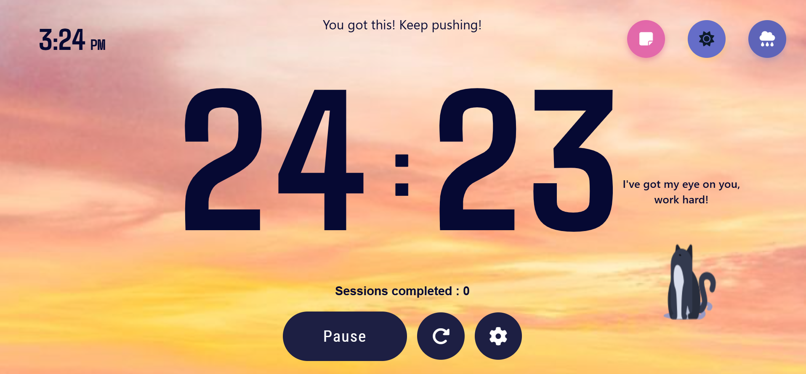
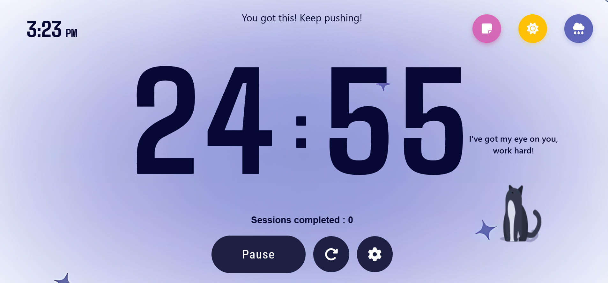
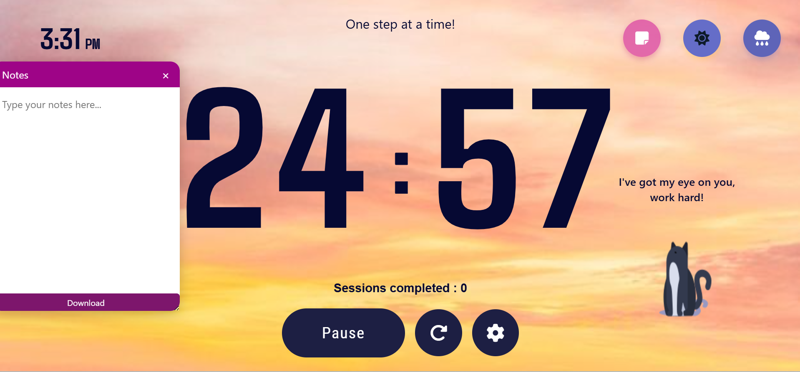

# 🌟 PeakClock – Interactive Productivity Timer

**PeakClock** is a modern, feature-rich timer designed to help you focus, track sessions, and boost productivity with an interactive, visually appealing interface.

---

## 🎯 Features

### ⏱ Timer & Productivity
- Customizable **work & break durations** via settings.
- **Start / Pause / Reset** timer controls.
- Automatic transition between **work and break sessions**.
- **Session counter** to track completed focus sessions.

### 💡 Motivational UX
- Rotating motivational quotes for **work** and **break** sessions.
- Animated **Watcher character** for encouragement.
- Real-time **clock** with AM/PM display.

### 🌈 Vibe Modes
- **Rainy Mode:** Toggle soothing rain sounds.
- **Sunny Mode:** Bright visuals for energizing focus.
- Smooth transitions between modes.

### 📝 Notes System
- Draggable & resizable **floating notes panel**.
- Auto-saves notes using **localStorage**.
- Download notes as a **.txt file**.

### 🔔 Notifications
- Audio alert when a session completes.
- Browser notifications for work/break reminders.

### 📱 Responsive Design
- Fully optimized for **desktop, tablet, and mobile** screens.

---

## 🎨 Tech Stack
- **HTML5**, **CSS3**, **JavaScript (Vanilla)**  
- **Lottie Animations** for interactive visuals  
- **Font Awesome** for icons  
- **Browser APIs:** Audio, Notifications, localStorage  

---
## 📸 Screenshots

  
  
  

   

## ⚙ How It Works
1. Set **work & break durations** in the settings modal.  
2. Start the timer to begin a focus session.  
3. Watch motivational quotes & **animated Watcher**.  
4. Timer switches automatically between **work and break**.  
5. Toggle **Rainy or Sunny modes** for desired ambiance.  
6. Take notes in the **draggable panel** and download as `.txt`.  
7. Track completed sessions with the **session counter**.  

---

## 🚀 Future Enhancements
- Dark mode for night usage.  
- Cloud sync for notes and session data.  
- Optional AI-based focus suggestions.  

---

## 👩‍💻 Author
**Pavithra Kishore** – Developer & UI/UX Enthusiast  
[GitHub](https://github.com/PavithraKishore05) 

---

## 📄 License
Open-source under the **MIT License**.